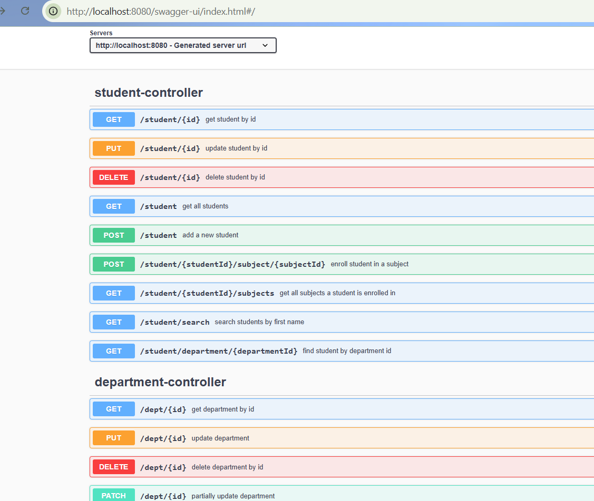

# College Management System

A Spring Boot backend application for managing students, departments, professors, and subjects in a college.

The project focuses on building REST APIs with proper layering, database relationships, validation, exception handling, and Swagger documentation.

---

## Key Highlights

- Layered architecture (Controller → Service → Repository)
- DTO-based API design
- Pagination and sorting support
- Custom JPQL queries
- Global exception handling
- Swagger/OpenAPI documentation
- Student enrollment workflow with duplicate enrollment prevention

---

## Tech Stack

- Java 24
- Spring Boot
- Spring Data JPA
- Hibernate
- MySQL
- ModelMapper
- Swagger / OpenAPI
- Maven

---

## Database

- MySQL is used as the relational database.
- Hibernate is used as the ORM framework.
- Spring Data JPA is used for database access and query generation.

---

## Features

- Student management (CRUD operations)
- Department management (CRUD operations)
- Professor management (CRUD operations)
- Subject management (CRUD operations)
- Student enrollment in subjects (Many-to-Many)
- Input validation using annotations
- Global exception handling
- RESTful API design
- Swagger API documentation
- Pagination and sorting support
- DTO-based request and response handling
- Search APIs using custom repository methods
- Custom JPQL queries for advanced data retrieval
- Audit fields for entity creation and update tracking
- Interactive API testing using Swagger UI

---

## Entity Relationships

- Department → Students (One-to-Many)
- Department → Professors (One-to-Many)
- Professor → Subjects (One-to-Many)
- Student ↔ Subjects (Many-to-Many)
- Student enrollment management with relationship mapping and validation

---

## API Documentation

Swagger UI:
http://localhost:8080/swagger-ui/index.html

---

## API Screenshots

### Swagger UI

### Student APIs

----
## How to Run the Project

1. Clone the repository:
   git clone https://github.com/prachi1862/college-management-system.git

2. Create MySQL database:
   CREATE DATABASE college_management_system;

3. Configure application.properties:
   spring.datasource.url=jdbc:mysql://localhost:3306/college_management_system
   spring.datasource.username=root
   spring.datasource.password=your_password
   spring.jpa.hibernate.ddl-auto=update
   spring.jpa.show-sql=true

4. Run the application:
   mvn spring-boot:run

5. Open Swagger UI:
   http://localhost:8080/swagger-ui/index.html

---

## Project Structure

---
src/main/java
├── controller
├── service
├── repository
├── entity
├── dto
├── exception
└── config
----

---

## Architecture

The application follows a layered architecture:

Controller → Service → Repository → Database

- Controllers handle HTTP requests and responses.
- Services contain business logic.
- Repositories interact with the database using Spring Data JPA.
- DTOs are used for request and response mapping.
- Entities represent the database model.

---

## Future Improvements

- JWT Authentication and Role-based Access Control
- Frontend integration using React
- Deployment on cloud (AWS / Render / Railway)
- Docker containerization

---

## Author

Prachi Mehra
B.Tech Computer Science & Engineering

Skills demonstrated in this project:
- Spring Boot
- Spring Data JPA
- Hibernate
- REST API Development
- MySQL
- DTO Mapping
- Swagger/OpenAPI
- Exception Handling
- Pagination & Sorting